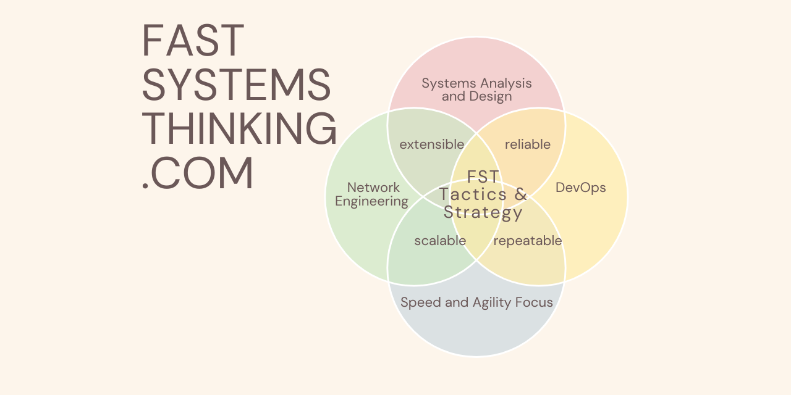

# Go.FastSystemsThinking.com

## A Crisis Management Worshop for Network and Security Incidents.
Systems thinking and network engineering are closely related as they both involve the study of complex systems. Network engineering is a subfield of computer science that focuses on the design, implementation, and maintenance of computer networks. Systems thinking, on the other hand, is a way of thinking about and understanding complex systems, including computer networks.

Systems thinking can be applied to network engineering in several ways:

1. Understanding the system as a whole: Systems thinking emphasizes the importance of understanding the entire system and how its various parts interact with each other. This can help network engineers to design more effective and efficient networks that take into account the different components and how they interact.

2. Identifying feedback loops: Feedback loops are an essential aspect of complex systems, including computer networks. Systems thinking can help network engineers to identify feedback loops and understand how they can impact network performance and reliability.

3. Considering multiple perspectives: Systems thinking involves considering multiple perspectives when analyzing a complex system. In the context of network engineering, this might involve considering the needs and requirements of different stakeholders, such as end-users, network administrators, and IT managers.

4. Adapting to changing conditions: Complex systems, including computer networks, are subject to change and uncertainty. Systems thinking can help network engineers to develop systems that are adaptable and resilient in the face of unexpected events or changes.

Overall, the principles of systems thinking can help network engineers to design, implement, and maintain more effective and efficient computer networks that are better able to meet the needs of users and stakeholders.

## CODED - A Methodology for Fast Systems Thinking

- **Capture the Constraints** - [Goldratt’s Theory of Constraints](https://www.leanproduction.com/theory-of-constraints/) 
- **Observe, Orient, Decide and Act** - [OODA Loop](https://en.wikipedia.org/wiki/OODA_loop)
- **Discover the Distinctions, Systems, Relationships and Perspectives** - [DSRP](https://en.wikipedia.org/wiki/DSRP)
- **Express and Communicate** - [Communication Theory](https://en.wikipedia.org/wiki/Communication_theory)
- **Do!!!** - [DevOps.Diet](https://devops.diet) 
    - **Define Success**: Set Overall Mission and Iterative Goals
    - **Identify Your Path**: Build, Implement, and Improve Living Processes with Purpose
    - **Execute as a Team**: Trust, Communicate, and Cooperate
    - **Transform and Innovate**: Experiment, Measure, Analyze, Decide, Act
